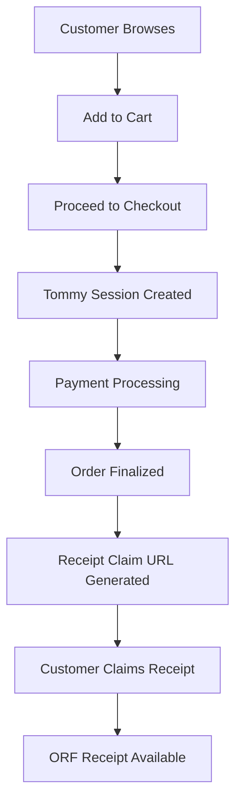

# Tommy the Tapir: Online Commerce Architecture

## Overview

Tommy the Tapir works wherever a transaction occurs — **in-store or online** — because it models the receipt, not the channel.

## Online Commerce Challenges

Traditional online commerce suffers from:
- **Inconsistent receipts** across platforms
- **Vendor lock-in** to specific platforms
- **Email-only delivery** with poor accessibility
- **Poor long-term access** to transaction history

## ORF + Tommy Solutions for Online

Tommy enables:
- **Wallet-style receipt storage** across all merchants
- **Cross-merchant aggregation** in a single interface
- **Expense automation** through standardized formats
- **Consumer-controlled history** independent of vendors

## Key Insight: Channel Independence

Online platforms already have:
- Transaction ID generation
- Stable order objects
- Controlled receipt timing

Tommy adds:
- **Standardized receipt** format (ORF)
- **Claim-based delivery** mechanism
- **Portability** across platforms

## 1. The Key Difference: Offline vs Online Constraints

| Constraint | Physical | Online |
|------------|----------|---------|
| **Connectivity** | Unreliable | Reliable |
| **Identity** | Optional | Often present |
| **Trust moment** | Human | System |
| **Latency tolerance** | Low | Higher |

### Physical Store Constraints
- **Intermittent connectivity** requires offline-capable design
- **Anonymous interactions** need human verification
- **Real-time expectations** demand immediate response
- **Face-to-face trust** through cashier confirmation

### Online Store Constraints
- **Always-connected** environment enables rich features
- **User authentication** provides identity verification
- **System-level trust** through platform validation
- **Higher latency tolerance** allows complex processing

## 1.1. Comprehensive Physical vs Online Comparison

| Aspect | Physical Store | Online Store |
|--------|----------------|---------------|
| **Customer Journey** | | |
| Entry point | NFC/QR tags, physical signage | Web links, buttons, redirects |
| Product discovery | In-person browsing, shelf tags | Search, categories, recommendations |
| Cart building | Physical selection, memory | Digital cart, persistent sessions |
| Checkout | Cashier interaction, POS system | Automated checkout, payment gateway |
| Trust establishment | Human cashier confirmation | System validation, platform trust |
| **Technology Requirements** | | |
| Hardware | NFC tags, QR codes, mobile devices | Web servers, APIs, integration points |
| Connectivity | Intermittent, offline-capable | Always-connected, high bandwidth |
| User interface | Mobile web, responsive design | Web application, mobile app |
| Session management | Client-side, minimal server dependency | Server-side, persistent sessions |
| **Trust Mechanisms** | | |
| Identity verification | Physical presence, face-to-face | Account authentication, email verification |
| Transaction validation | Human cashier confirmation | Automated order processing |
| Payment verification | Cash handling, POS receipt | Payment gateway confirmation |
| Dispute resolution | Immediate human interaction | Platform policies, customer service |
| **Operational Aspects** | | |
| Staff involvement | High (cashier confirmation required) | Low (automated processing) |
| Error handling | Real-time correction possible | Automated validation, retry mechanisms |
| Inventory management | Real-time POS integration | E-commerce platform integration |
| Customer support | In-person assistance | Digital support channels |
| **Integration Approaches** | | |
| POS integration | Adjacent to existing POS systems | Embedded in checkout flow |
| Payment processing | External to Tommy's core | Optional adapters, multiple providers |
| Receipt generation | After cashier confirmation | Immediately after order finalization |
| Customer communication | In-store, immediate | Email, SMS, platform notifications |
| **Receipt Handling** | | |
| Claim mechanism | NFC tag scan, QR code | Web URL, button click |
| Timing | Immediate or delayed claim | Immediate availability |
| Format | ORF with cashier confirmation | ORF with system validation |
| Storage | Customer wallet/app | Customer wallet/web account |
| **Security Considerations** | | |
| Data collection | Minimal (session-based) | Customer accounts, order history |
| Authentication | Optional, session-based | Required, account-based |
| PCI compliance | Handled by existing POS | Handled by payment processors |
| Privacy | Limited data retention | Customer data management required |
| **Scalability Factors** | | |
| Geographic distribution | Store-by-store deployment | Centralized, global deployment |
| User capacity | Limited by physical location | Virtually unlimited |
| Processing load | Distributed across locations | Centralized processing |
| Maintenance | Physical tag management | Software updates, server maintenance |
| **Cost Considerations** | | |
| Initial setup | NFC tags, staff training | Platform integration, development |
| Ongoing costs | Physical maintenance | Server costs, API usage |
| Training requirements | Staff education on Tommy | Developer integration, customer education |
| ROI measurement | Reduced receipt requests | Enhanced customer experience metrics |

## 2. Tommy in Online Commerce (Conceptually)

In online commerce, Tommy becomes:
**A receipt-first checkout companion, not a storefront replacement.**

Tommy does not compete with:
- Shopify
- WooCommerce
- Magento
- Other e-commerce platforms

Instead, Tommy **complements** existing platforms by providing standardized receipt generation and consumer-controlled access.

## 3. Online Tommy Architecture

```
[Product Page / Cart]
        ↓
[Tommy Session]
        ↓
[Payment Provider]
        ↓
[Receipt Claim]
        ↓
[ORF Receipt]
```

### Tommy Integration Modes

Tommy can be implemented as:

#### Embedded (JS SDK)
```javascript
// Drop-in JavaScript SDK
import Tommy from '@tommy/web-sdk';

const tommy = new Tommy({
  merchantId: 'merchant_123',
  environment: 'production'
});

// Initialize on checkout page
tommy.initializeCheckout({
  cart: cartData,
  customer: customerData
});
```

#### Linked (Redirect)
```javascript
// Redirect to Tommy for receipt handling
const receiptUrl = tommy.createReceiptSession({
  orderId: 'order_123',
  amount: 42.50,
  currency: 'USD'
});

// Redirect customer
window.location.href = receiptUrl;
```

#### Headless (API-only)
```javascript
// Pure API integration
const receipt = await tommy.createReceipt({
  orderId: 'order_123',
  items: orderItems,
  total: orderTotal,
  customerId: customerId
});

// Return receipt URL to customer
return receipt.claimUrl;
```

## 4. Entry Points (Online Equivalent of NFC / QR)

Replace physical NFC/QR tags with digital entry points:

### Digital Entry Points
- **"View Receipt" link** in order confirmation
- **"Claim Receipt" button** in customer account
- **Order confirmation page** integration
- **Webhook-triggered** claim URL

### Example Claim URL
```
https://tommy.example.com/r/9QZ8
```

**This is exactly the same claim mechanism** used in physical stores, providing consistency across channels.

### Implementation Examples

#### Order Confirmation Page
```html
<!-- Add to existing order confirmation -->
<div class="receipt-section">
  <h3>Your Receipt</h3>
  <p>Save your receipt for easy access:</p>
  <a href="https://tommy.example.com/r/9QZ8" 
     class="tommy-claim-btn">
    Save to My Wallet
  </a>
</div>
```

#### Email Integration
```html
<!-- In order confirmation email -->
<p>View and save your receipt: 
   <a href="https://tommy.example.com/r/9QZ8">Save Receipt</a>
</p>
```

#### Customer Dashboard
```javascript
// Add to existing customer account
function addTommyReceipts(customerOrders) {
  return customerOrders.map(order => ({
    ...order,
    tommyReceiptUrl: `https://tommy.example.com/r/${order.tommyId}`,
    claimButton: renderClaimButton(order.tommyId)
  }));
}
```

## 5. Assertion Model: Physical vs Online

### Physical Store Assertion
```json
{
  "receipt_assertion": {
    "asserted_by": "merchant",
    "assertion_method": "cashier_confirmation"
  }
}
```

### Online Store Assertion
```json
{
  "receipt_assertion": {
    "asserted_by": "system",
    "assertion_method": "order_finalized"
  }
}
```

### Key Differences

| Aspect | Physical | Online |
|--------|----------|---------|
| **asserter** | merchant (human) | system (automated) |
| **assertion_method** | cashier_confirmation | order_finalized |
| **trust_source** | Human verification | System validation |
| **timing** | Real-time interaction | Automated processing |

### Same ORF Fields, Different Semantics

Both use identical ORF structure but with context-appropriate semantics:
- **Physical**: Trust established through human interaction
- **Online**: Trust established through system validation

## 6. Payment Integration Remains Optional

Even in online commerce, payment integration is optional:

### Supported Payment Models

Payment may be:
- **On-site** (processed by merchant platform)
- **Redirect-based** (third-party checkout)
- **Third-party hosted** (PayPal, Amazon Pay, etc.)

### Payment Event Handling

Tommy **observes** payment events and **ORF references** them descriptively:

```json
{
  "payments": [
    {
      "method": "redirect",
      "provider": "stripe_checkout",
      "reference": "cs_live_...",
      "amount": 42.50,
      "currency": "USD"
    }
  ],
  "receipt_assertion": {
    "asserted_by": "system",
    "assertion_method": "order_finalized",
    "assertion_time": "2026-01-02T14:10:00Z"
  }
}
```

### Compatible Payment Providers

This works seamlessly with:
- **Stripe Checkout**
- **PayPal**
- **BNPL** (Buy Now Pay Later)
- **Cryptocurrency** payments
- **Bank transfer**
- **Invoicing** systems

## 7. Online Tommy Session Flow

### Complete Customer Journey



### Implementation Flow

1. **Product Selection**
   ```javascript
   // Customer adds items to cart
   const cart = {
     items: [...],
     total: 42.50,
     currency: 'USD'
   };
   ```

2. **Checkout Initiation**
   ```javascript
   // Tommy creates session at checkout
   const session = tommy.createSession({
     cart: cart,
     customer: customerData,
     merchant: merchantData
   });
   ```

3. **Payment Processing**
   ```javascript
   // Payment handled by existing systems
   const payment = await processPayment(cart.total);
   
   // Tommy observes payment event
   session.recordPaymentEvent({
     provider: 'stripe',
     reference: payment.id,
     amount: payment.amount
   });
   ```

4. **Order Finalization**
   ```javascript
   // Order completion triggers receipt generation
   const receipt = await tommy.finalizeOrder({
     sessionId: session.id,
     orderId: generatedOrderId,
     paymentReference: payment.id
   });
   ```

5. **Receipt Claiming**
   ```javascript
   // Customer receives claim URL
   // URL: https://tommy.example.com/r/{receiptId}
   // Customer can claim immediately or later
   ```

## 8. Benefits for Online Retailers

### For E-commerce Platforms
- **Enhanced customer experience** with persistent receipt access
- **Reduced support tickets** about missing receipts
- **Compliance assistance** with receipt retention requirements
- **Customer satisfaction** through modern receipt handling

### For Consumers
- **Unified receipt history** across all Tommy-enabled merchants
- **Wallet integration** for expense tracking
- **Searchable transaction history** independent of merchant platforms
- **Automatic categorization** for expense management

## 9. Implementation Strategies

### For Existing E-commerce Platforms

#### Shopify Integration
```javascript
// Shopify app integration
Shopify.pages.afterRender(() => {
  if (window.location.pathname.includes('/checkouts/')) {
    Tommy.initializeOnCheckout();
  }
});
```

#### WooCommerce Integration
```php
// WordPress plugin
add_action('woocommerce_thankyou', 'tommy_add_receipt_claim');

function tommy_add_receipt_claim($order_id) {
    $tommy_url = tommy_generate_claim_url($order_id);
    echo '<p><a href="' . $tommy_url . '">Save your receipt</a></p>';
}
```

#### Custom Platform Integration
```javascript
// API-first approach
app.post('/api/orders', async (req, res) => {
  // Create order in your system
  const order = await createOrder(req.body);
  
  // Generate Tommy receipt
  const receipt = await tommy.createReceipt({
    orderId: order.id,
    items: order.items,
    total: order.total
  });
  
  // Include receipt URL in response
  res.json({
    order: order,
    receiptUrl: receipt.claimUrl
  });
});
```

## 10. Migration Path for Online Retailers

### Phase 1: Basic Integration
- Add receipt claim URLs to order confirmations
- No changes to existing checkout flow
- Customer education about receipt claiming

### Phase 2: Enhanced Integration
- Embed Tommy in checkout process
- Payment event observation
- Enhanced customer notifications

### Phase 3: Full Integration
- Complete Tommy checkout companion
- Advanced analytics and reporting
- Cross-platform receipt aggregation

## 11. Technical Considerations

### Performance
- **Minimal impact** on page load times
- **Asynchronous** receipt processing
- **CDN distribution** for global accessibility

### Security
- **No sensitive data** stored in Tommy sessions
- **Merchant authentication** for receipt creation
- **Customer verification** for receipt claiming

### Scalability
- **Stateless architecture** for horizontal scaling
- **API rate limiting** to prevent abuse
- **Multi-tenant** support for multiple merchants

## Future Enhancements

### Planned Online Features
- **Mobile wallet integration** (Apple Wallet, Google Pay)
- **Receipt analytics** for merchants
- **Automatic expense categorization**
- **Tax preparation** integration
- **Loyalty program** cross-referencing